<h1 align="center">System Monitor</h1>

  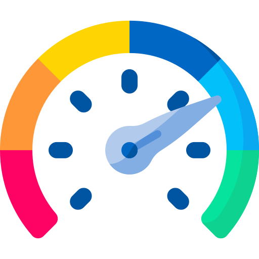

  Make your Android Phone or Tablet your PC / Gaming Rig Monitoring Companion

**System Monitor – Android App - Your PC Monitoring Companion** 

System Monitor is an Android app that lets you monitor and display real-time statistics of your PC or computer directly on your phone.
It provides detailed insights into hardware, system performance, temperatures, and sensors.
The companion System Monitor Server App runs on Windows in the background and securely streams system data to the Android app.

**System Monitor – Server App (Windows)**

The Server App must be installed on the PC you want to monitor.
It connects securely to the Android app and streams system statistics in real time.
## ⬇️ Download

Get the latest stable release of **System Monitor**:

### 🖥️ Windows (Server App)
- 👉 [Download Installer (.exe)](https://github.com/jayant-droid/System-Monitor/releases/latest)
- 👉 [Download MSI Package (.msi)](https://github.com/jayant-droid/System-Monitor/releases/latest)

### 📱 Android (Client App)
- 👉 [Download APK](https://github.com/jayant-droid/System-Monitor/releases/latest)

> ℹ️ APK is provided for testing purposes.  
> For production use, prefer the Google Play version (coming soon).

<h3 align="center">🎥 Video Tutorials</h3>

  
  &nbsp;&nbsp;
  

  <b>Android App Walkthrough</b> &nbsp;&nbsp;&nbsp;&nbsp;
  <b>Server App Setup & Usage Guide</b>

## 📸 Setup

---

## 🖥️ System Monitor — Server App (Windows x64)

### 1️⃣ Server App Installer

  
  

  <b>Installer</b> &nbsp;&nbsp;&nbsp; <b>Application Options</b>

---

### 2️⃣ Server Running

  

  <b>Server Started Successfully</b>

---

## 📱 System Monitor — Android App

### 1️⃣ App Launch & Server Discovery

  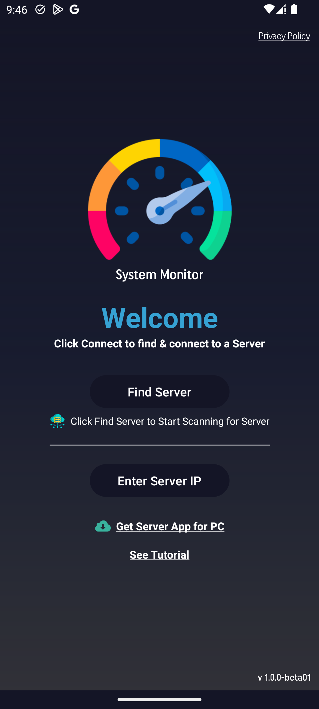
  

  <b>Welcome / Connection Screen</b> &nbsp;&nbsp;&nbsp; <b>Find & Select Server</b>

---

### 2️⃣ Monitor Selection

  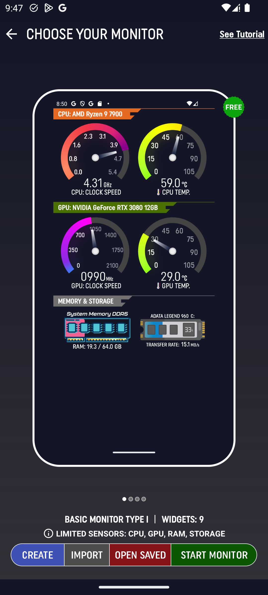
  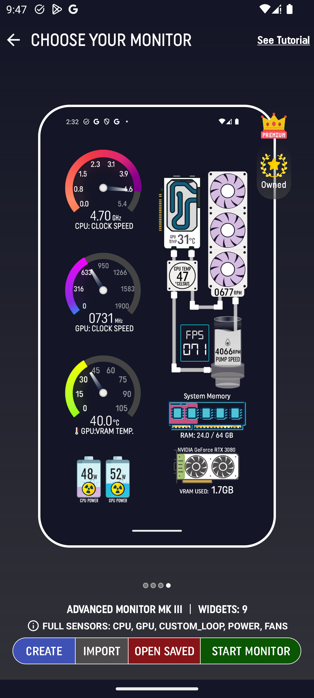

  <b>Basic Monitor</b> &nbsp;&nbsp;&nbsp; <b>Advanced Monitor</b>

---

### 3️⃣ Monitor Editor

  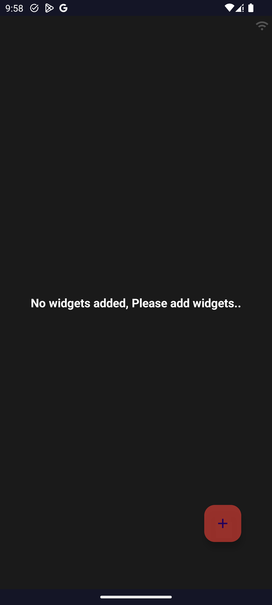
  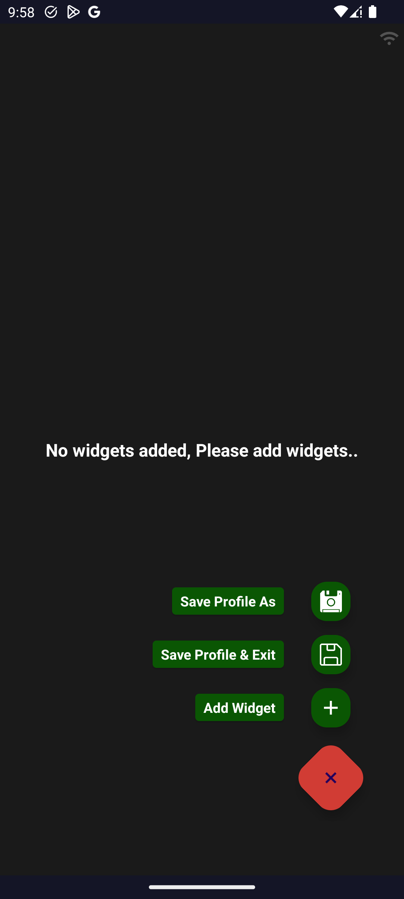

  <b>Editor – Start Page</b> &nbsp;&nbsp;&nbsp; <b>Basic Options</b>

---

### 4️⃣ Widget & Sensor Configuration

  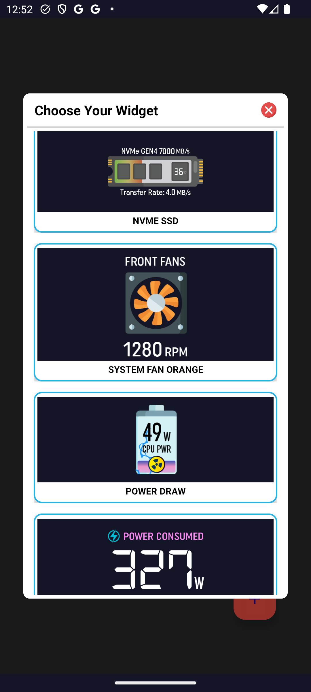
  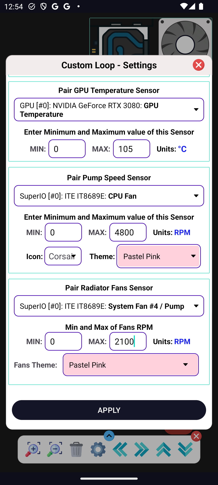

  <b>Widget Selection</b> &nbsp;&nbsp;&nbsp; <b>Sensor Pairing</b>

---

### 5️⃣ Saved & Custom Monitors

  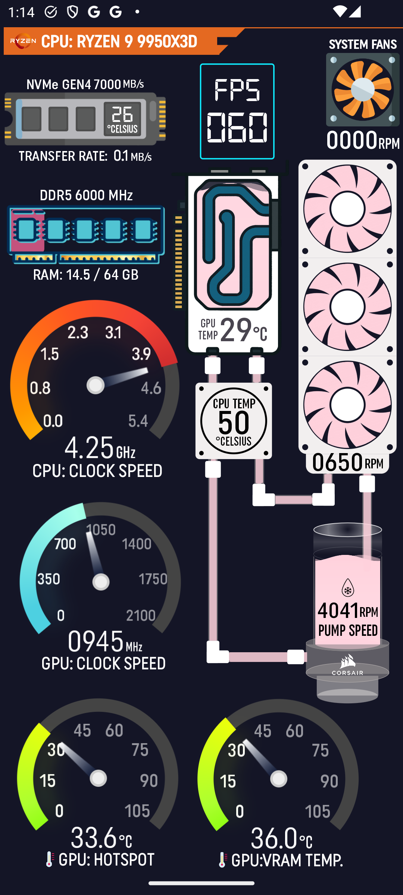
  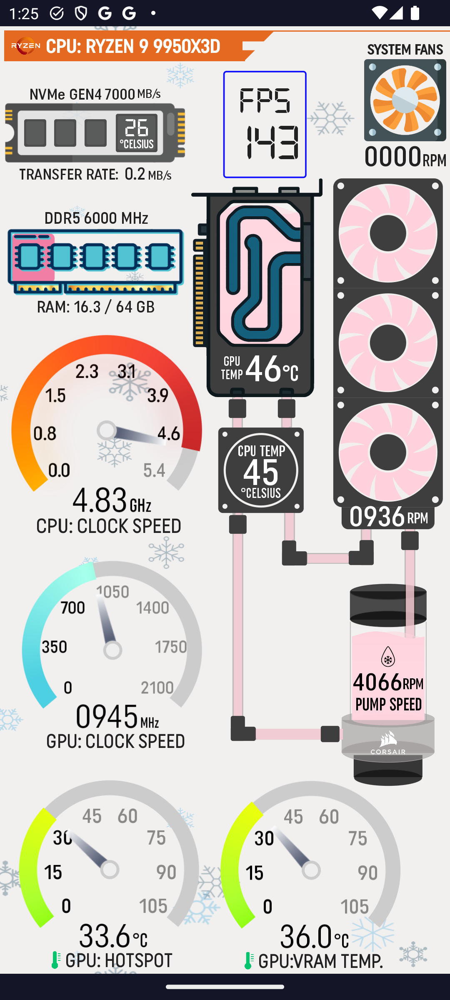

  <b>Custom Monitor (Dark)</b> &nbsp;&nbsp;&nbsp; <b>Custom Monitor (Light)</b>

---

### 6️⃣ Load Saved Monitors

  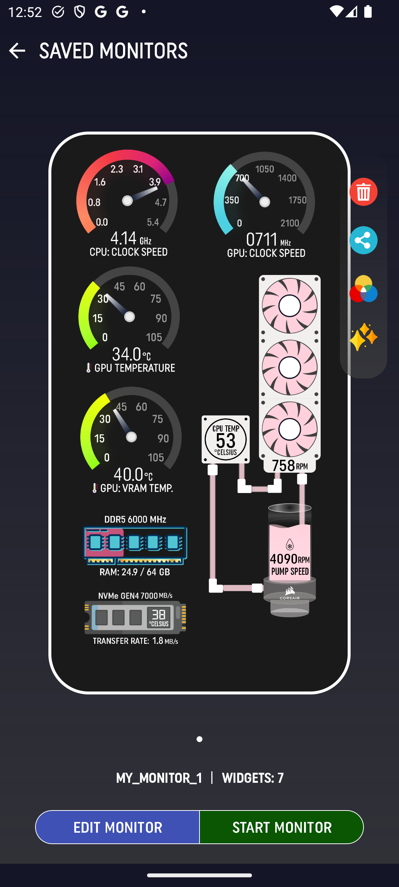

  <b>Load Previously Saved Monitors</b>

**System Monitor – Android App**

**🚀 FEATURES**

**📊Monitors**

Comes with free, preconfigured monitors to track basic PC stats.

Comes with advanced, preconfigured monitors to track advacnced PC stats, you have to unlock widgets in order to use them.

**📊Monitor Creator**

Create your own custom monitors using the built-in editor.

Pair compatible sensor with respective widget or widgets to design monitors exactly the way you want.
Pairing is guided in the app. It is easy and filetered according to component.

Export and import monitors to other Android devices using the Share option.

**🧩Widgets**

Widgets represent sensors or a collection of sensors displayed as a UI component.

Example: A CPU widget can show temperature, frequency, power usage, and more.

New widgets are added regularly.

Have an idea for a widget? Want a custom one?
👉 Contact me — with Android, almost anything is possible.

💰 **Monetization**

The app is free to use

Includes optional in-app purchases

**System Monitor – Server App (Windows)**

**🚀 FEATURES**

**🖥 Supported Platforms**

Microsoft Windows 10 or later

x86 and x64 architectures

Download available in the Releases section

**🔐 Security**

Uses HTTPS and WSS (WebSocket Secure) connections

Fully encrypted and secure communication

⚙️ **Server App Modes**

You can run the server in two modes:

**✅ Option 1: Standalone Mode (Recommended)**

No third-party dependencies

Uses built-in SDK to monitor PC sensors

Supports:

Temperatures

Power usage

Frequencies

Framerate monitoring

Most hardware sensors

Best choice for most users

🔄 **Option 2: HWiNFO Integration**

Requires HWiNFO running in the background

Shared Memory Support must be enabled in HWiNFO

Use this mode if:

Some sensors are missing

You have very new or uncommon hardware

You need access to specific or advanced sensors

**👉 If possible, stick to Option 1 — it does not require HWiNFO.**

**🆓Pricing**

Server App is completely free to use

🔒 **Privacy Disclaimer**

We respect your privacy and are committed to transparency.

👉 We do NOT collect, store, or sell any personal user data.
